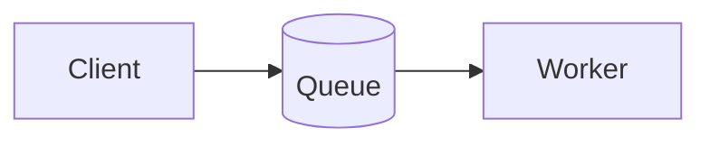

# Document Authoring & Export

Ziya can author **work-product documents** — reports, memos, specs — as a
first-class artifact distinct from conversation transcripts, and export them
as high-fidelity PDFs rendered through the real chat renderer (KaTeX math,
mermaid/graphviz/vega-lite/packet diagrams, chemfig/tikz LaTeX, Prism
syntax highlighting).

## The document IR

A document is a plain markdown file with YAML front-matter, stored in
`<project>/.ziya/documents/`. The file is the single editing surface: the
model (or you) revises it with ordinary edits, and rendering happens only at
export time. The file stays portable — it renders sensibly on GitHub or any
markdown viewer.

```markdown
---
ziya-doc: 1
title: "Queue Depth Analysis — Q3"
subtitle: "Capacity headroom for the ingest tier"   # optional
author: "yourname"        # optional; byline + PDF /Author
date: 2026-09-19          # optional; ISO date or free text; default today
layout: report            # report = title block on page 1;
                          # titlepage = title block on its own page;
                          # plain = no chrome
numbering:                # optional; `numbering: true|false` sets all
  sections: false         # 1 / 1.1 / 1.1.1 prefixes on h1–h3 (and bookmarks)
  figures: true           # "Figure N" under every diagram/image
  tables: true            # "Table N" above every table
page:
  margin: 18mm            # one value, or {top, bottom, left, right}
---

# Executive Summary

Ordinary Ziya markdown: math like $\rho = 0.85$, tables, code, diffs,
and diagram fences all render at full fidelity.



Figure: Request path. A `Figure:` paragraph directly below a diagram
becomes its caption.

Table: Depth by utilization. A `Table:` paragraph directly above (or
below) a table becomes its caption.

| Utilization | Mean depth |
|------------:|-----------:|
| 0.85 | 5.7 |

<!-- ziya:pagebreak -->

# Model

Starts on a new page. The pagebreak directive is an HTML comment —
invisible in every other markdown viewer.
```

Front-matter keys are all optional; invalid values fall back to defaults
rather than failing the export. Keep semantic sources in the IR (LaTeX,
diagram DSLs) — never pre-rendered images — so future export targets can
choose native mappings per construct.

## Typesetting

The document export is typeset, not a screen dump. Everything below is
automatic; the front-matter above is the only control surface.

- **Title block** — title, optional subtitle, and a byline (author ·
  formatted date, e.g. `September 19, 2026`, never a locale-numeric date)
  under a rule. `layout: titlepage` gives the block its own first page.
- **Heading scale** — body `h1`/`h2`/`h3` step down from the title
  (17/13.5/11.5 pt) so the document title dominates; `h4` is a small-caps
  run-in. With `numbering.sections`, headings carry `1`, `1.1`, `1.1.1`
  and the PDF bookmarks carry the same numbers.
- **Figures** — every diagram or image is centred at its natural size
  (never up-scaled; down-scaled only if wider than the column), kept whole
  with its caption, and labelled `Figure N.` A `Figure:` line supplies the
  caption text; without one the label alone is emitted so prose can still
  refer to it. `numbering.figures: false` drops the labels and keeps only
  explicit captions.
- **Tables** — report style: a header rule, hairline rows, zebra fill,
  lining tabular digits, `Table N.` caption above. A table taller than
  ~45 % of the page flows across pages with its header row repeated on
  each page instead of being pushed whole onto a fresh page behind a
  blank band.
- **Pagination** — a heading is never stranded at a page bottom: it moves
  with the stacked headings under it and with the first following block
  (paragraph, list, quote, short table, code, figure, display math).
  Orphans/widows are held to three lines; figures and short tables are
  atomic. Use `<!-- ziya:pagebreak -->` only for parts that should open a
  page (appendices, major sections of a long report).
- **Running footer** — `Title · Author · Date` on the left, `Page N of M`
  on the right, with a small Ziya credit (version · model) on a lighter
  second line. Chromium draws the same footer on every page, including a
  title page.

## Exporting

`POST /api/export/document` returns PDF bytes:

```bash
# By stored name (relative to .ziya/documents/):
curl -X POST localhost:6969/api/export/document \
  -H 'Content-Type: application/json' \
  -d '{"name": "q3-report.md"}' -o report.pdf

# Or inline:
curl -X POST localhost:6969/api/export/document \
  -H 'Content-Type: application/json' \
  -d '{"markdown": "---\ntitle: X\n---\n# Hello"}' -o out.pdf
```

Optional body fields: `title` (overrides front-matter), `includeFooter`
(default **true**, matching the other export routes — the running footer
is always drawn unless you pass `"includeFooter": false`).

The PDF gets:
- A **nested outline** (bookmarks) generated from the h1–h4 heading tree
  (with section numbers when `numbering.sections` is on).
- Document metadata: front-matter `title` as /Title, front-matter `author`
  (or the model/provider) as /Author.
- Real page breaks at each `<!-- ziya:pagebreak -->`.

Under the hood (`app/utils/document_print_decor.py`): the shared `/print`
route renders the body, then the exporter injects the document stylesheet
and runs a decoration pass (numbering, captions, long-table flow, title
block) before the keep-with-next and outline passes, so every capture
shares one pagination. Documents render under **print** media at a
viewport matched to the printable box — Chromium only repeats table
headers under print media, and matching the viewport makes the in-page
measurements agree with the pages it paginates. Conversation transcripts
keep the screen-media path unchanged.

Requires Playwright (`pip install playwright && playwright install
chromium`); the endpoint returns HTTP 501 when it is absent.

## The `document_authoring` skill

A built-in model-discoverable skill teaches the model the IR contract and
the workflow: author into `.ziya/documents/`, revise with targeted edits
(never full regeneration), extract-and-restructure when promoting a
conversation into a document, caption every figure and table with a
`Figure:` / `Table:` line and refer to them by number, reserve
`<!-- ziya:pagebreak -->` for major parts, and render via the export
endpoint.

## Relationship to conversation export

Conversation export (Export Conversation modal: markdown / HTML / PDF /
paste targets) is transcript-shaped and unchanged. Document export shares
the same headless render session and `/print` route in document mode — no
message chrome, no role labels — so the two paths cannot drift in rendering
fidelity.
