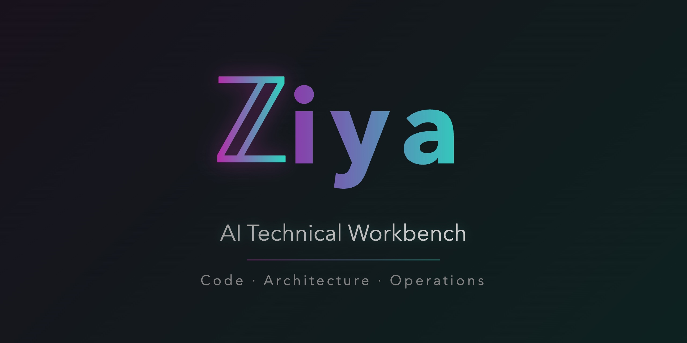

<p align="center">
  
</p>

<p align="center">
Self-hosted AI workbench for code, architecture, and operations.<br>
Runs alongside your editor — not instead of it.
</p>

<p align="center">
  <a href="https://pypi.org/project/ziya/"></a>
  <a href="https://pypi.org/project/ziya/"></a>
  <a href="https://github.com/ziya-ai/ziya/blob/main/LICENSE"></a>
  <a href="https://github.com/ziya-ai/ziya/stargazers"></a>
</p>

---

Ziya is a complete AI working environment. Code generation, architecture analysis, operational debugging, visual output, persistent context, parallel agents, tool integration — it handles the full surface of how senior engineers actually work, not just the editing part. Two years of daily production use across hundreds of engineers went into making every normal workflow feel right. Self-hosted, MIT licensed, runs alongside your editor.

See [Design Philosophy](Docs/DesignPhilosophy.md) for the reasoning behind the choices.

---

## What You Get

Code changes come back as rendered diffs with per-hunk Apply/Undo buttons — a 4-stage patch pipeline handles imperfect model output so you never copy-paste from a chat window. Conversations persist across sessions with context you control: mute dead-end messages, fork to explore alternatives, drop files you're done with. No auto-compaction deciding for you. Persistent memory carries domain knowledge across sessions. Parallel agent swarms decompose large tasks into delegates with dependency ordering, memory crystals, and crash-resilient checkpointing. MCP tool integration with HMAC result signing, poisoning detection, and shell allowlisting. AST-based code intelligence with cross-file reference tracing. Projects with scoped conversations and reusable skill bundles. Web UI and full CLI from the same codebase.

Multiple windows into the same codebase with different selected context, different models, even different conversations — open as many as make sense for how you work. Multiple projects with completely different codebases, each with their own conversations and context selections. You decide what layout fits your workflow.

Seven visualization renderers — Graphviz, Mermaid, Vega-Lite, DrawIO, KaTeX, HTML mockups, packet frame diagrams — all render inline with a normalization layer that fixes broken LLM output. The model chooses the right format for the situation: a dependency graph when you're debugging, a sequence diagram when you're tracing a flow, a chart when you're looking at data, rendered math when you're working through a proof, a mockup when you're designing a UI. You don't pick the renderer — you describe the problem and the response comes back visual when visual is the right answer.

An immense amount of engineering went into making all of this feel like one tool, not twelve features bolted together. Standard MCP tool protocol, reusable skill bundles, and agent delegation work the way you'd expect — Ziya isn't a closed system. [Feature Inventory](Docs/FeatureInventory.md) has the full reference.

### Same conversation, different universe every time

**Debug a deadlock** — Paste the thread dump. Get a dependency graph showing the cycle. The model correlates the lock ordering with your source code in the same conversation.

**Iterate on a UI** — Describe a component, get a rendered HTML mockup inline. Adjust the layout, spacing, color. Each revision renders live in the conversation — no switching to a browser, no Figma, no screenshots.

**Model a system mathematically** — Discuss queueing theory for a rate limiter. The model derives the steady-state probabilities and renders them as fully typeset KaTeX — not ASCII approximations, real mathematical notation. Then plot the results: arrival rate vs. queue depth as a chart, sensitivity analysis across parameter ranges, distribution curves — right in the same conversation. Formulas and their visualizations, together.

**Analyze a protocol** — Drop in a pcap, a header file, and a client implementation. Ziya reads all three and synthesizes a graph showing the error domains. Or if you're designing a protocol: lay out the frame format as a bit-level diagram with field widths and byte boundaries, then trace how each field is actually used across the codebase to find inconsistencies between the spec and the implementation.

**Diagnose a production incident** — Drag in a monitoring screenshot. Paste the error log. Add the service code. The model works through the root cause — choosing whatever visualization fits: a timing chart for latency patterns, a sequence diagram for request flow, a dependency graph for cascade failures — and generates the fix as an applicable diff.

**Refactor a codebase** — Decompose a migration into parallel agents. Each handles a module independently, produces a memory crystal when done, downstream agents pick up where upstream left off. Apply the diffs when they come back.

---

## Quick Start

```bash
pip install ziya
```

**For AWS Bedrock** (default):
```bash
export AWS_ACCESS_KEY_ID=<your-key>
export AWS_SECRET_ACCESS_KEY=<your-secret>
ziya
```

**For Google Gemini:**
```bash
export GOOGLE_API_KEY=<your-key>
ziya --endpoint=google
```

**For OpenAI:**
```bash
export OPENAI_API_KEY=<your-key>
ziya --endpoint=openai
```

Then open [http://localhost:6969](http://localhost:6969).

**CLI mode** (no browser):
```bash
ziya chat                          # Interactive chat
ziya ask "what does this do?"      # One-shot question
ziya review --staged               # Review git staged changes
git diff | ziya ask "review this"  # Pipe anything in
```

---

## Supported Models

| Provider | Models | What You Need |
|---|---|---|
| **AWS Bedrock** | Claude Sonnet 4.6/4.5/4.0/3.7, Opus 4.6/4.5/4.1/4.0, Haiku 4.5/3, Nova Premier/Pro/Lite/Micro, DeepSeek R1/V3, Qwen3, Kimi K2.5, and more | AWS credentials with Bedrock access |
| **Google** | Gemini 3.1 Pro, 3 Pro/Flash, 2.5 Pro/Flash, 2.0 Flash | Google API key |
| **OpenAI** | GPT-4.1/Mini/Nano, GPT-4o, o3, o3-mini, o4-mini | OpenAI API key |
| **Anthropic** | Claude (direct API) | Anthropic API key |

Switch models mid-conversation. Configure temperature, top-k, max tokens, and thinking mode from the UI.

---

## Documentation

- [Design Philosophy](Docs/DesignPhilosophy.md) — why Ziya makes the choices it does
- [Feature Inventory](Docs/FeatureInventory.md) — complete capability reference
- [Architecture Overview](Docs/ArchitectureOverview.md) — system design
- [MCP Security](Docs/MCPSecurityControls.md) — tool security model
- [Skills](Docs/Skills.md) — reusable instruction bundles
- [User Configuration](Docs/UserConfigurationFiles.md) — `~/.ziya/` config files
- [Enterprise](Docs/Enterprise.md) — pluggable auth, encryption at rest, deployment at scale

## Author

Ziya is primarily built and maintained by [Dan Cohn](https://github.com/purlah), with early contributions from [Vishnu Kool](https://github.com/vishnukool).

## Contributing

See [CONTRIBUTING.md](CONTRIBUTING.md) for guidelines.

## Security

See [SECURITY.md](SECURITY.md) for reporting vulnerabilities.

## License

MIT — see [LICENSE](LICENSE).
