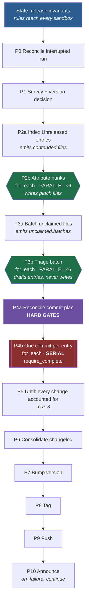

# Sweep, orchestrated

The `sweep` file task (`.ziya/tasks.yaml`) is a single linear prompt of nine
steps handed to one agent. It works, and its *rules* are right — they encode
several releases' worth of hard-won corrections. What it cannot do is survive
scale, and the failure is structural rather than a wording problem.

`design/sweep-orchestrated.task-card.json` is the same nine steps expressed as
a Task Card block tree, so the parts that need iteration iterate, the parts
that need judgement have somewhere to record it, and the checks that were
exhortations become assertions.

## What actually broke

Measured on a real `ziya task sweep` invocation against this repository:

| Quantity | Value |
| --- | --- |
| Changed paths | 403 |
| Tracked modifications | 169 |
| Untracked paths | ~234 |
| `## [Unreleased]` entries | 77 |
| Files claimed by exactly one entry | 88 |
| Files claimed by 2–6 entries (contended) | 38 |
| Changed files named by no entry | 202 |

The run never reached step 3. It spent its whole context on the survey, then
stopped and asked the operator to choose between two grouping strategies —
which the prompt explicitly forbids ("Never halt and ask the user to choose —
the rules already decide").

The agent was not being disobedient. Three things were genuinely true at once:

1. **77 commits do not fit in one context window.** Each commit needs the
   entry text, the file list, a staging decision and a verification. The
   survey alone consumed enough context that the remaining budget could not
   have held the work even if it had started.
2. **38 contended files needed per-hunk attribution first.** Commit *N*'s
   staging depends on knowing which hunks belong to it, so this is a
   prerequisite phase, not something to improvise per commit.
3. **202 unclaimed files needed triage.** The prompt says to author the
   missing entries, which is correct, but it is ~202 independent judgements
   and the prompt offers no way to make them other than serially, in the same
   exhausted context.

So the halt was the honest response to an under-resourced instruction. The fix
is not firmer wording. It is to stop asking one agent to hold the whole
release.

## The shape



Green is parallel and read-only. Red is serial and mutating. Purple is the
gate everything downstream trusts.

## Why each shape

### The commit loop is serial, and that is not a performance oversight

`repeat_parallel: false` on P4b is the single most load-bearing field in the
card. **The git index is one shared resource.** Two concurrent iterations each
running `git add` interleave, and both then commit — producing two commits that
each contain the other's files. Nothing errors: every `git commit` succeeds,
every iteration reports success, and the corruption is only visible later in
`git log`.

Parallelism is the natural instinct at 77 iterations and it is exactly wrong
here. The card gets its speed from the *analysis* phases instead, which are
read-only and genuinely independent.

That is also why P2b writes **patch files** rather than staging: six
concurrent attribution agents must not touch the index. Its only shell grant is
`git apply --cached --check`, the validate-only form. The multi-word
token-prefix grant means a bare `git apply --cached <patch>` mismatches at the
fourth token and is refused, so the read-only guarantee is enforced rather than
merely requested.

### Coverage is asserted, not requested

The linear prompt's COUNT CHECK asks the agent to compare its planned group
count against the entry count and go back if it is materially lower. On
v0.8.6.1 that produced 20 commits from 63 entries, and nothing failed.

Two mechanical replacements:

- **P4a hard-gates the plan on coverage.** Every `- ` entry must appear in
  exactly one group's `entry_ids`; an entry in no group, or in two, fails the
  block with the numbers. So does any changed path appearing in neither a group
  nor the exclusion list, and any path claimed whole-file by two groups.

  Coverage rather than a count comparison, because grouping is legal (see
  below) and a merged plan legitimately has fewer groups than entries. The
  count check would fail exactly the plans the escape exists to permit, while
  coverage catches the thing that actually matters: an entry that silently does
  not ship.
- **P4b sets `repeat_require_complete: true`** with `repeat_item_key:
  "entry_id"`. The loop FAILS at exit unless every roster member has a passed
  iteration, naming the ones that do not. This is the primitive built for
  exactly this defect, and it needs the key: without iteration→member identity
  a shortfall can be counted but never named.

`repeat_require_complete` contradicts a finite `repeat_max` and is refused at
both validation and plan time, which is correct here — a release's commit
count is not something to cap.

**Its documented limit applies and is not papered over:** coverage is
status-shaped, not output-shaped. An iteration reporting success while
committing nothing still counts as covered. Two things close that gap: the
commit stage verifies its own commit with `git log -1 --stat` and checks the
staged set against its group before committing, and P5 re-derives the truth
from `git status` afterwards.

### Grouping is permitted; collapsing is not

Measured on the release this card was written for: 88 changed files map cleanly
to one entry, and **38 are claimed by 2–6 entries**. Splitting all 38 by hunk is
the ideal and is what P2b attempts. But a hunk-level split is a judgement, and
demanding one unconditionally forces the agent to choose between inventing a
split it is not confident in and failing the block — and an invented split is
the worse outcome, because it produces a clean commit whose subject names work
it does not contain, which nothing downstream can detect.

So P2b carries an explicit escape. A file whose hunks cannot be confidently
attributed gets no patch files; instead the stage writes a merge record naming
every entry that claims it and the specific obstacle that blocked the split.
P4a folds each such set into one group whose `entry_ids` is the union.

Three things keep that from becoming the omnibus commit one step removed:

- **Every merge names an obstacle.** "Hard to tell" is refused at both ends —
  the stage that writes the record and the stage that applies it. The reason is
  the only evidence a later reader has that the merge was necessary.
- **A merged subject must enumerate.** It is the one place the subject test's
  comma rule is waived, because the split it would demand is precisely what was
  unavailable. That comma is the visible cost.
- **The escape is capped.** If more than half the entries end up in merged
  groups, P4a fails: at that point attribution did not do its job, and the run
  would produce a history no better than the one this card replaces.

The seam is the load-bearing part and is test-pinned: attribution writes merge
records, and P4a must *read* them. Records written and never read is the one-hop
failure that loses every entry in a merge set except whichever one the file
happened to land under — both halves correct, nothing erroring.

### Rosters travel by artifact; everything else travels by file

Two channels, deliberately split:

- **`repeat_for_each_source` must be a template**, so each fan-out roster
  crosses as a precise artifact reference:
  `{{previous_sibling.outputs.contended.files}}`. That form matches the strict
  parser, so a source resolving to no array FAILS the loop instead of silently
  iterating over nothing.
- **Everything else crosses through `.ziya/sweep/ledger.json`.** A loop
  iteration can only see the previous iteration's summary, so commit 60 cannot
  read commit 3's artifacts. The ledger is the iteration-to-iteration memory
  `{{previous}}` cannot be, and it is what makes resume work.

`.ziya/` is writable with no grant, so the entire coordination substrate costs
no signature.

### No author-supplied block ids

The card uses only `{{previous_sibling}}`, never `{{sibling("id")}}`. Block ids
are server-assigned, and a card whose templates name ids is one re-save away
from silent breakage — a missing field renders as an empty string, so the
symptom is a fan-out that dispatches zero iterations and reports success.

To make that possible each fan-out is wrapped in a `group` with its producer
immediately before it. That is why P2, P3 and P4 are groups rather than four
flat siblings: it puts every roster producer in `previous_sibling` position.
`tests/test_sweep_orchestrated_card.py` pins that adjacency, because inserting
a stage between a producer and its loop is the natural edit that breaks it.

### Failure policy

Every container is `on_failure: "stop"` except the announce group. This matters
more than it looks: a container's artifact is its LAST child's, so under the
default `continue` a failed early stage followed by a passing late one reports
the whole container as **succeeded**. The failure would not merely be
tolerated, it would be invisible.

The announce group is `continue` on purpose — a failed GitHub Release must not
skip the Slack post, and both are best-effort. Since it is the last child of a
`stop` root, nothing downstream inherits the leniency.

## Escalation surface

The analysis half asks for nothing that mutates.

| Block | Grant | Why |
| --- | --- | --- |
| P2b leaf | `git apply --cached --check` | validate patches without touching the index |
| P4b leaf | `git add`, `git rm`, `git commit`, `git apply` | the commits |
| P5 leaf | `git add`, `git rm`, `git commit` | straggler commits |
| P6 | write `CHANGELOG.md` | the only stage that writes it |
| P7 | `bump-version.py` regex, `git add`, `git commit`, write version files | the bump |
| P8 | `git tag` | creating the annotated tag |
| P9 | `git push` | the push |
| P10a | `gh release create` | the release |

The P8 grant was not in the first draft of this card, on the reading that
`git tag` already sat in the read-only floor and so needed no escalation. That
was true, and it was a defect in the floor rather than a property worth
relying on: the floor's pattern guarded `-d`/`--delete` alone, so `git tag -a`
— and the flagless `git tag v1.0` lightweight form, which carries no flag for
a guard to catch — were admitted at a tier described to the model as
read-only. With that closed, tag creation is a signed grant like every other
mutation here, which is where it belongs.

No grant admits `reset`, `checkout`, `restore`, `clean`, `rebase`, `merge`,
`cherry-pick`, `filter-branch`, `--force`, `--amend` or `--no-verify`. That is
asserted, not assumed.

One consequence is deliberate: **the commit loop has no unstage grant.** A
failed `git apply --cached` cannot be cleaned up, which is why every patch goes
through `--check` first and why a mismatched staged set fails the block instead
of attempting repair. Handing an automated loop `git reset` to recover with
trades a visible stall for a silent one.

## Known limits

- **Hunk attribution is a judgement.** P2b decides which entry owns each hunk
  of a contended file from the entries' own prose. A misattribution produces a
  clean commit with the wrong subject, which no gate downstream detects. It
  runs at `medium` tier for that reason, is asked to flag hunks it could not
  attribute confidently, and has the merge escape above for the cases where it
  cannot attribute at all. The escape narrows this limit without removing it: a
  low-confidence split is still permitted and still undetectable, and only an
  agent that *declares* its uncertainty gets the safe path.
- **P5 can stall.** Its condition is model-evaluated and it is capped at 3.
  The stall breaker also applies. It is deliberately *not* "the working tree is
  clean" — excluded in-progress work legitimately stays uncommitted, and
  demanding cleanliness would either fail every release or push work nobody
  reviewed.
- **Self-improvement is observe-only.** P4b sets `self_improve: true` with
  `improve_max: 0`: the judge runs and records lessons in the project's ledger
  but never edits the card. A card that pushes to a real remote is not where
  self-rewriting instructions should be trialled; the lessons are still worth
  having, since grouping quality is precisely what has gone wrong before.
- **`.ziya/` is gitignored in this repository.** Several `## [Unreleased]`
  entries cite `.ziya/tasks.yaml` and `.ziya/complandscape/*.md` as changed
  files, and no clean checkout will ever have them. The card's exclusion rule
  states this so a stage does not waste a pass trying to commit them, but the
  changelog entries themselves are describing files that cannot ship.

## Using it

The card is data, not a registered task — `ziya task` runs file tasks from
`tasks.yaml`, and cards launch from the deck or the API. The JSON in this
directory is the source of truth; installing it is a `POST` of that file, whose
body is already exactly the create shape:

```bash
curl -X POST "http://localhost:6969/api/v1/projects/<PROJECT_ID>/task-cards" \
  -H 'Content-Type: application/json' \
  --data-binary @design/sweep-orchestrated.task-card.json
```

Then:

1. **It must be persisted before it can be signed.** Approvals key on block
   ids, and ids are minted by `TaskCardStorage.create`, so signing a card that
   only exists as a file is not possible.
2. Run the `ziya-approve --all` command the deck tile shows. **Eight blocks
   escalate** — the four that commit or push, the two that write the changelog
   and version files, the tag, and the GitHub release. The analysis half does
   not, and nothing anywhere requests `reset`, `checkout`, `clean`, `rebase` or
   a forced push.
3. Signing is not optional. Unsigned, the run is clamped to the permission
   floor and dies at the first `git add` — after the analysis half has already
   been paid for.
4. **Start.** If a run is interrupted, launch it again — P0 reconciles
   `.ziya/sweep/ledger.json` against git and resumes at the lowest genuinely
   incomplete phase.

The `release` task (build, publish, `#ziya-interest`) is unchanged and still
runs afterwards. The `release-announcement` skill is unchanged too — P10b loads
it rather than restating its rules, so the two cannot drift.
